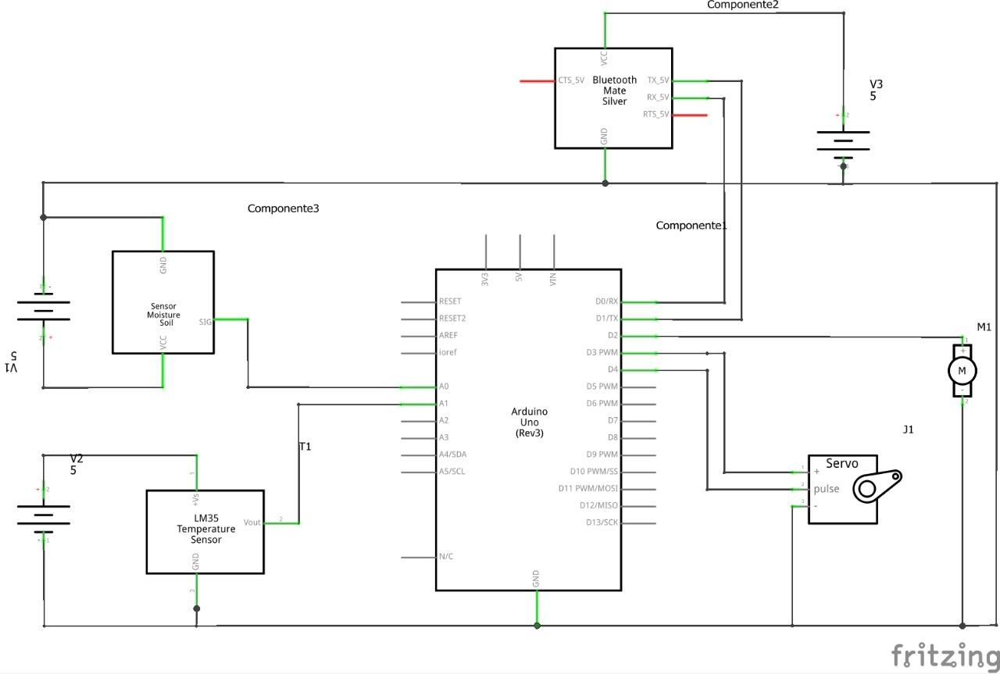

# Controlador de estufa - Hardware
Esquema do Hardware do sistema.

## Esquema

## Materais
* [Arduino UNO R3](https://store.arduino.cc/usa/arduino-uno-rev3)
* [Módulo HC05]( https://www.filipeflop.com/produto/modulo-bluetooth-rs232-hc-05/)
* [Módulo sensor de umidade do solo higrômetro](https://www.filipeflop.com/produto/sensor-de-umidade-do-solo-higrometro/)
* [Servo motor](<https://www.filipeflop.com/blog/micro-servo-motor-9g-sg90-com-arduino-uno/)
* [Cooler de computador](sem informações sobre fornecedor pois foi retirado de um computador inutilizado)

## Estufa
Desenho da estufa (esquematico).

