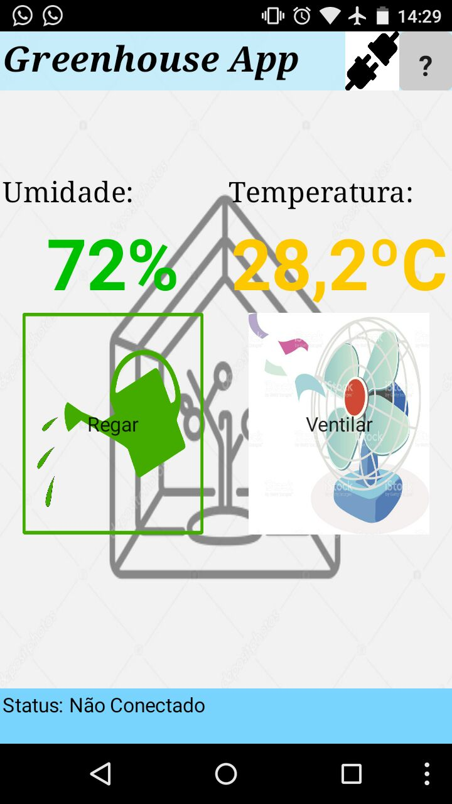
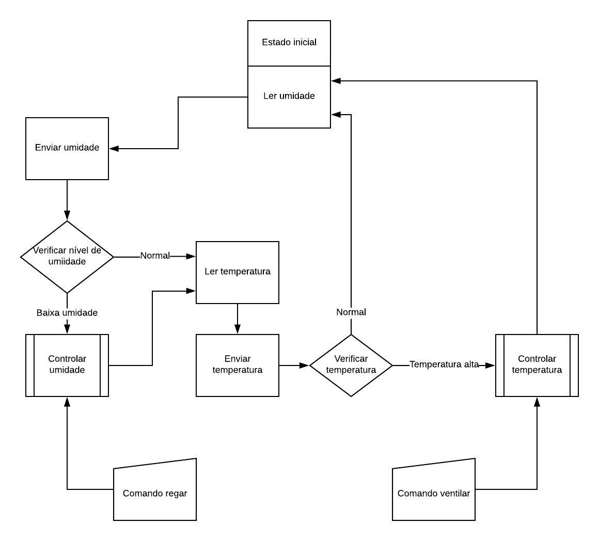

# Estufa Automatizada
Projeto de um sistema para uma estufa automatizada e controlada para a disciplina de Sistemas Embarcados na Universidade Federal de Uberlândia.

## Sobre o projeto

Os arquivos estão divididos da seguinte maneira:
* **Aplicativo**: Código para ser importado no AppInvetor.
* **Firmware**: Códigos desenvolvidos para o microcontrolador **ATMEGA328P**.
* **Hardware**: Circuito eletrônico, diagramas de conexão e esquemas de montagem.
* **resourses**: Images utilizadas neste README, referências, artigo, etc.

## Aplicativo

O aplicativo foi desenvolvido no AppInvetor e faz a interface Homem-Máquina do sistema. Abaixo uma imagem da sua interface:

## Firmware

O Firmware foi feito usando programação C em modo Bare Metal para o microcontrolador ATMEGA328P, que é usando na **arduino UNO R3**. O seu código pode ser resumindo através da seguinte máquina de estados:

Para isso, o software foi separado em diversas partes:
* **main_irrigador.ino**: Máquina de estados e código unindo todas as bibliotecas e demais funções;
* **leitura_analogica**: Biblioteca desenvolvida para configurar e realizar leituras do conversor AD do microcontrolador.
* **comunicacao_uart**: Biblioteca desenvolvida para realizar a comunicação serial do sistema, configurando os registradores do microcontrolador, enviando e recebendo informações da aplicação móvel.
* **library_pwm**: Biblioteca de controle do *pwm* (Pulse Width Modulation) do microcontrolador.
* **general_input_output**: Biblioteca de I/O(não utilizada nesta aplicação).
* **arduino_timers**: Controle dos timers internos do arduino(não utilizada nesta aplicação).

## Licence

Se isso foi util de alguma forma, nos pague uma cerveja. Vlws.

## Autores

* **Mário Borges** - github.com/alpinista06
* **Talles Rodrigues**

Colaborador: Ítalo Fernandes - github.com/italogfernandes
